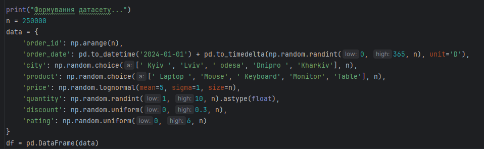
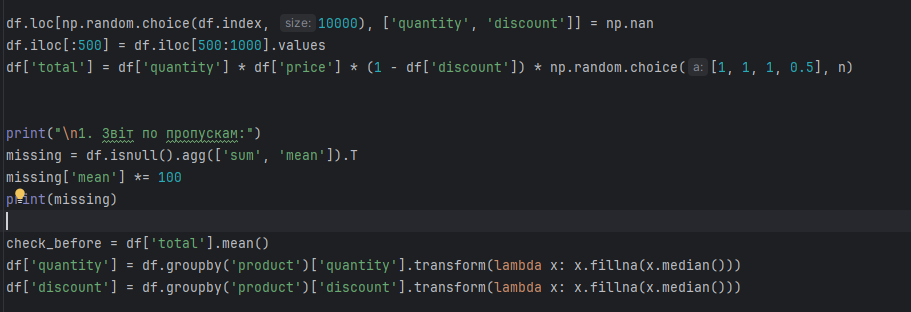
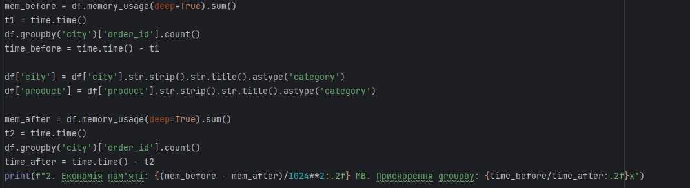

# Практична робота №1
Цей репозиторій cтворений для перегляду виконання практичної роботи №1 з дисципліни "Технології збору та обробки даних", виконане студентом Щур Р.І., групи ТВ-32.

## Мета роботи:
Розробка та реалізація автоматизованого конвеєра для очищення, оптимізації та статистичного аналізу великого масиву даних.
## Поставлені завдання:
1)Побудувати звіт пропусків по всіх колонках (кількість/%), заповнити quantity і discount медіаною по product, а потім порівняти середній чек до/після імпутації.

2)Очистити city і product (пробіли/регістр), перетворити їх у category, виміряти економію пам’яті та порівняти час groupby(city) до/після.

3)Перетворити order_date у datetime, відфільтрувати тільки 2 вибрані міста, згрупувати по місяцях і знайти місяць з максимальним середнім total.

4)Знайти дублікати за order_id, видалити їх, а потім оцінити, як змінилася сумарна виручка по кожному city (до/після).

5)Перевірити коректність total за формулою quantity * price * (1-discount), знайти невідповідності, виправити total і порахувати середню абсолютну різницю до/після виправлення.

6)Виявити викиди у price методом IQR, видалити їх, побудувати pivot_table «місто × товар» для суми total і порівняти топ-3 комбінації до/після очищення.

7)Виявити некоректні значення rating (менше 1 або більше 5), замінити їх на NaN, виконати імпутацію медіаною по product і порівняти середній рейтинг товарів до/після.

8)Зробити сортування замовлень за order_date, побудувати кумулятивну суму продажів по часу (Pandas), і знайти дату, коли досягнуто 50% загальної виручки.

9)Об’єднати “замовлення” з довідником товарів (створити окремий DataFrame з категоріями/собівартістю), виконати merge, знайти рядки без відповідників і оцінити їхню частку.

10)Виконати groupby(product) з агрегаціями count/sum/mean/median/std для total, відсортувати за сумою та сформувати «топ-5 товарів + інші» з часткою у загальній виручці.

11)Реалізувати Min-Max нормалізацію price через NumPy, додати колонку price_norm, перевірити діапазон [0,1] і порівняти стандартне відхилення price та price_norm.

12)Зробити Z-score для price через NumPy, позначити викиди (|z|>3), порівняти їх кількість із IQR-методом у Pandas та пояснити різницю на статистиках.

13)Згенерувати через NumPy синтетичні замовлення (≥200 000 рядків) з полями price/quantity/discount/date, завантажити в Pandas і порівняти час groupby до і після оптимізації типів.

14)Перетворити числові колонки у float32/int32, порівняти пам’ять, а також похибку середнього значення price (різниця між float64 і float32).

15)Побудувати кореляційну матрицю для (price,quantity,discount,rating) через numpy.corrcoef і pandas.corr, порівняти значення та зробити висновок щодо узгодженості.

16)Сформувати NumPy-матрицю ознак X = [price,quantity,discount], стандартизувати її (центрування+масштабування), перевірити що середні≈0 і std≈1, та повернути результат у Pandas.

17)Реалізувати лінійну регресію total ~ price + quantity + discount через лінійну алгебру NumPy (нормальні рівняння), порівняти прогнозну помилку з простою моделлю total ~ price.

18)Побудувати часовий ряд виручки по днях, застосувати rolling-середнє (вікно 7), а потім альтернативно порахувати те саме через NumPy (cumsum) і порівняти максимальну різницю між методами.

19)Побудувати pivot_table «місяць × місто» для суми total, знайти місто з найбільшою сезонною різницею (max-min) та пояснити результат через статистики.

20)Скласти “індекс якості даних” як середнє нормованих метрик (частка NaN, частка дублікатів, частка некоректних значень, частка викидів), порахувати його до/після пайплайна очищення і зробити висновок.

## Програмна реалізація:

Програмна реалізація починається з формування датасету, з яким будуть проводитимуться подальші роботи. Набір даних містить 250 000 рядків та включає такі стовпці: order_id (унікальний ідентифікатор), order_date (дата замовлення), city (назва міста), product (назва товару), price (ціна одиниці товару), quantity (кількість), discount (розмір знижки) та rating (рейтингова оцінка).

Зазначу, що деякі стовпці навмисно формуються з помилками: наприклад, у назвах міст додано зайві пробіли та порушено регістр написання. Це реалізовано з метою подальшого тестування алгоритмів очищення, валідації та виправлення даних у межах пайплайну.

Для перевірки стійкості алгоритмів, у структуру даних вносяться штучні дефекти. Зокрема, у 10 000 випадкових замовлень видаляються дані про кількість та знижку (пропуски NaN), створюється блок дубльованих записів (копіювання перших 500 рядків), а також навмисно викривляється фінальна сума чека (total) шляхом випадкового множення на 0.5 у частині транзакцій. Це дії мають на меті імітувати збої при вивантаженні даних.
Після спеціальної деформації даних починається наступний етап, а саме формування звіту про цілісність даних, де розраховується кількість та відсоткова частка порожніх значень у кожній колонці. Для відновлення втрачених даних у колонках quantity та discount застосовується метод імпутації медіаною, але не загальною, а розрахованою окремо для кожного виду товару, що дозволяє зберегти специфіку споживання різних категорій продуктів.

Наступним етапом роботи програми є нормалізація даних та підвищення продуктивності коду. Для цьог спочатку фіксуються початкові показники обсягу пам'яті та швидкості групування за містами. Далі виконується очищення стовпців city та product від зайвих пробілів уніфікується регістр та проводиться зміна типу даних на category.
Така оптимізація дозволяє замінити повторювані текстові рядки на компактні числові індекси. У результаті досягається суттєве зменшення використання оперативної пам'яті та кратне прискорення аналітичних операцій.

Наступні блоки програми відповідають за роботу з часовими рядами, програма перетворює стовпець order_date у формат datetime, що дозволяє програмі розпізнавати дати як об'єкти, а не як текст. Для аналізу створюється підмножина даних (subset), яка включає лише два міста — Київ та Львів. На основі цих даних проводиться групування за місяцями для пошуку періоду з найвищим середнім чеком (total), що допомагає виявити сезонні піки продажів у конкретних регіонах.
Після цього проводиться робота з видалення дублікатів та аналізу фінансових змін. Метою цього етапу є дедуплікація даних для забезпечення точності фінансової звітності. Спочатку фіксується сумарна виручка по містах у поточному стані. Після цього з датасету видаляються повторювані записи за унікальним номером замовлення order_id. Фінальний порівняльний розрахунок показує, як видалення «зайвих» транзакцій змінило показники виручки, що дозволяє оцінити масштаб похибки, спричиненої дублюванням замовлень.

